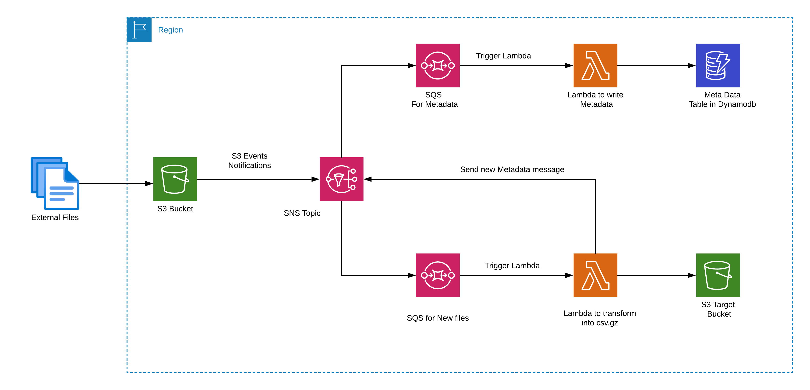

## COP-DataScience

A  demo to show how you can track metadata for files ingest and transform  in Aws.

Project to tack all the metadata files ingested in Aws S3, using Aws lambda function to apply some transformations and put in S3. 
To track this, we use an Aws lambda function triggered by Aws Sqs and store the information in the Aws Dynamodb table.

Using Terraform to deploy all the resources for this Project.

### Aws Diagram.



### Project Structure
```txt
.
├── README.md
├── convert_etl
│         ├── config.yml
│         ├── convert_file.py
│         ├── lambda_funtion.py
│         └── test
│            └── test_convert.py
├── deploy
├── diagram
│        └── COP-data.drawio.png
└── metadata
    ├── config.yml
    ├── lambda_function.py
    ├── metadata.py
    └── test
        └── test_metadata.py

```

### Technologies

- Aws S3
- Aws Lambda(Python)
- Aws SQS
- Aws Dynamodb
- Aws SNS

### TO DO:
- [ ] Integrate Aws SNS with Aws SQS.
- [ ] Add Terraform to deploy the project.
 

